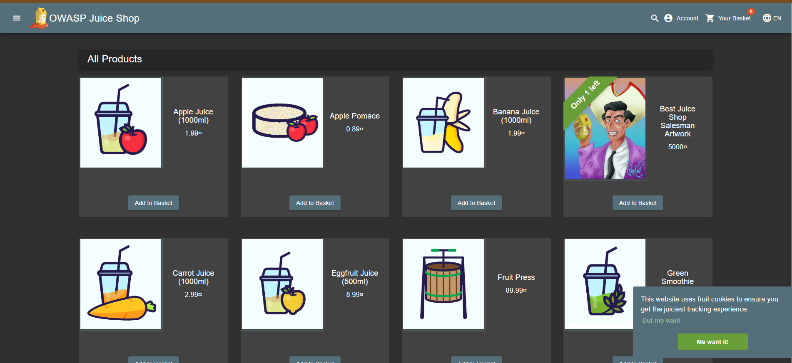

# Triage Report — OWASP Juice Shop

## Scope & Asset
- Asset: OWASP Juice Shop (local lab instance)
- Image: bkimminich/juice-shop:v19.0.0
- Release link/date: <https://github.com/juice-shop/juice-shop/releases/tag/v19.0.0> — 2025-09-04
- Image digest (optional): <sha256:2765a26de7647609099a338d5b7f61085d95903c8703bb70f03fcc4b12f0818d>

## Environment
- Host OS: Microsoft Windows 11 Pro
- Docker: 28.3.2

## Deployment Details
- Run command used: `docker run -d --name juice-shop -p 127.0.0.1:3000:3000 bkimminich/juice-shop:v19.0.0`
- Access URL: http://127.0.0.1:3000
- Network exposure: 127.0.0.1 only [X] Yes  [] No 

## Health Check
- Page load: 

- API check: first 5–10 lines from `curl  http://127.0.0.1:3000/#/about`:
    ```
    StatusCode        : 200
    StatusDescription : OK
    Content           : <!--
                        ~ Copyright (c) 2014-2025 Bjoern Kimminich & the OWASP Juice Shop contributors.
                        ~ SPDX-License-Identifier: MIT
                        -->

                        <!doctype html>
                        <html lang="en" data-beasties-container>
                        <head>
    ```

## Surface Snapshot (Triage)
- Login/Registration visible: [X] Yes  [ ] No — notes: Login and registration forms are available in the upper right corner of the navigation bar.
- Product listing/search present: [X] Yes  [ ] No — notes: The main page is a product catalog. Search is available in the top bar (magnifying glass).
- Admin or account area discoverable: [X] Yes  [ ] No — notes: Your personal account (/#/account) is accessible after logging in. Administrative functions are not immediately visible, but may be accessible through specific paths.
- Client-side errors in console: [ ] Yes  [X] No — notes: There are no critical errors in the developer console when loading the main page.
- Security headers: `curl -I http://127.0.0.1:3000` → CSP/HSTS not present, Security headers such as CSP or HSTS are not set by default, which is typical for a test application.

## Risks Observed (Top 3)
1) Cross-site request forgery (CSRF)

    vulnerability due to missing CSRF tokens and weak CORS headers
    The `Access-Control-Allow-Origin: *` header allows requests from any domain, and standard forms do not contain CSRF tokens during validation.

2) Exposure of the application's internal structure through informative headers

    The `X-Recruiting: /#/jobs` and `Feature-Policy: payment 'self'` headers reveal the application's internal paths and policies, aiding the attacker in reconnaissance.

3) Lack of critical security headers to protect against attacks

    The lack of `Content-Security-Policy`, `Strict-Transport-Security`, and `X-XSS-Protection` headers leaves the application vulnerable to XSS and MITM attacks and reduces overall security.

## PR Template Setup

### Template Creation Process
The PR template was created by following these steps:

1. **Switched to main branch:**
   ```bash
   git checkout main
2. **Created template file at .github/pull_request_template.md**
3. **Committed and pushed the template to main**

## Workflow Improvement Analysis
PR templates significantly enhance collaboration workflow in several ways:

1. Quality Assurance and Standardization
    - Every contributor knows exactly what information to provide
    - All PRs follow the same format, making reviews faster and more predictable
    - Required sections ensure critical information (testing, artifacts) isn't forgotten
2. Security-Specific Benefits
    -  Security considerations become part of the default workflow
    - Screenshots and logs provide audit trail for security findings
    - Checklist items like "No secrets included" proactively prevent security incidents

## GitHub Community


### Importance of Starring Repositories
Starring repositories on GitHub is crucial in open source development for several reasons:

- **Discovery & Visibility:** Stars help projects gain visibility in GitHub search and recommendations. More stars often indicate a trustworthy and useful project.

- **Appreciation & Motivation:** Stars show appreciation to maintainers, encouraging them to continue development and support.

- **Bookmarking:** Stars serve as personal bookmarks for interesting projects you might want to reference or contribute to later.

- **Professional Profile:** Your starred repositories appear on your GitHub profile, showcasing your interests and engagement with the developer community.


### Value of Following Developers
Following classmates, professors, and industry professionals provides significant benefits:

- **Learning Opportunities:** You can see how experienced developers solve problems, structure projects, and write code.

- **Networking:** Building connections within the DevOps community can lead to collaboration opportunities, job prospects, and knowledge sharing.

- **Project Discovery:** Following others helps you discover new tools, libraries, and best practices through their activity and starred repositories.

- **Community Building:** In educational settings, following classmates creates a supportive learning environment where you can share knowledge and help each other.

- **Career Growth:** Following industry leaders keeps you updated on trends and shows potential employers your active engagement in the field.
